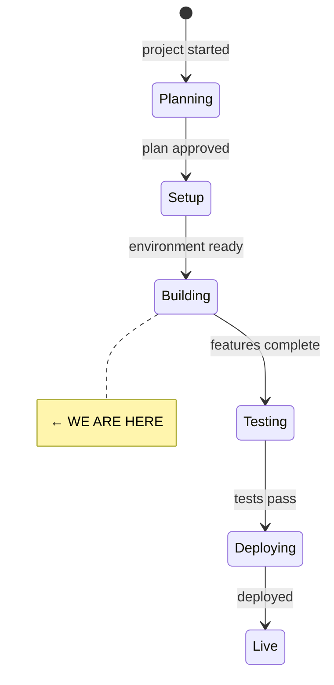
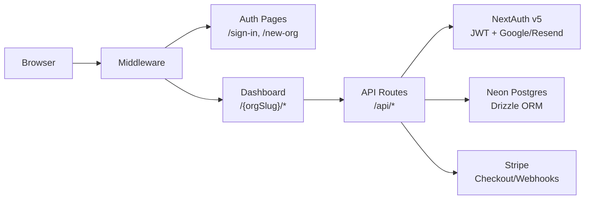

# State

> Last updated: 2026-07-06

## System State Diagram

## Component Status

| Component | Status | Notes |
|-----------|--------|-------|
| Project scaffolding | ✅ Done | Next.js 15, Tailwind v4, DM Sans, earth-tone theme |
| Database schema | ✅ Done | 7 schema files, centralized relations.ts, all enums |
| Auth (NextAuth v5) | ✅ Done | Google + Resend providers, JWT, lazy adapter Proxy |
| Middleware | ✅ Done | Protects org routes, allows /sign-in, /new-org, /api |
| API routes | ✅ Done | 12 route files — orgs, members, connections, moments, stripe |
| Dashboard pages | ✅ Done | 9 pages — dashboard, connections (list/new/detail), moments (list/new), settings, billing, members. `moments` index page added 2026-07-06 — sidebar had linked to it since Phase 1 but the page never existed (404), found via manual testing |
| Auth pages | ✅ Done | Sign-in (Google + magic link), new-org creation |
| UI components | ✅ Done | 12 primitives (button, input, card, badge, dialog, etc.) |
| Layout (sidebar/header/mobile) | ✅ Done | Responsive sidebar, mobile drawer, dynamic org-slug nav |
| Feature components | ✅ Done | Connection list/card/form/picker, moment form/card/list, org forms, billing |
| Stripe integration | ✅ Done | Lazy client, checkout, portal, webhook handler |
| Validators (Zod) | ✅ Done | Org, connection, moment, auth schemas (using zod/v3) |
| CI/CD | ✅ Done | GitHub Actions: lint, typecheck, test, build |
| Unit tests | ✅ Done | 12 tests (slugify + permissions) |
| Homepage flow | ✅ Done | CTA for unauth, auto-redirect for auth users |
| Network data model | ✅ Done | `network_links` table, canonical pair strength calc, co-mention inference hook, `GET /api/network` |
| Cluster detection | ✅ Done | Deterministic label propagation (`src/lib/network/clusters.ts`), wired into `GET /api/network` as `clusterId` per node |
| D3 network view | ✅ Done | `/{orgSlug}/network` page, static force-directed SVG render, nodes sized/colored, edges styled by strength |
| Network interactions | ✅ Done | Pan/zoom, node drag, hover tooltip, click-to-navigate to connection detail, type/strength/unconnected filters, search-and-center (`network-graph.tsx`, `network-controls.tsx`) |
| Connection story view | ✅ Done | Story section always visible (with empty state), moment stream now reuses `MomentList`/`MomentCard` |
| Quality spectrum UI | ✅ Done | 5 hardcoded spectrums (depth/reciprocity/formality/activity/maturity), manual position-setting via `POST /api/connections/[connectionId]/qualities`, sparkline history, wired into connection detail page |
| AI provider registry | ✅ Done | OpenRouter primary + local Ollama fallback via `withFallback()` (`src/lib/ai/`). Task→model config |
| AI moment understanding | ✅ Done | `POST /api/moments/understand` (read-only, no DB writes), structured output via `generateObject` (`run-object-task.ts`, `moment-understanding.ts`). Moment form now has an "Understand with AI" panel — matches existing connections (checkbox to add), lists unmatched entities (informational only, no auto-create), detects event date (prefills new date field). Moment form also gained its first-ever event date input |
| Automatic quality inference | ✅ Done | Every moment save now auto-infers quality signals for its linked connections (`src/lib/ai/quality-inference.ts`, the `"quality-inference"` task/cheap model), writing `source: "inferred"` rows with real `momentId`/`confidence` — best-effort, wrapped in its own try/catch so a failed AI call never blocks moment creation. Replaced the old manual "Apply" quality flow in the moment-understanding panel (would have double-written). Quality display now shows an "AI-suggested" badge for inferred rows. Verified live 2026-07-06 with a real OpenRouter key — one sentence of moment text produced two real inferred quality rows |
| Search | ✅ Done | Full-text search on moment content (Postgres `to_tsvector`/`plainto_tsquery` + GIN expression index), connection name search via `ilike`. `/{orgSlug}/search` server component, no new API route. Semantic/pgvector search deferred |
| AI thread synthesis | ✅ Done | Automatic, same pattern as quality inference — after a moment save, for each linked connection with ≥2 total moments, `src/lib/ai/thread-synthesis.ts` regenerates `connections.threadSummary` (incremental: passes the previous summary + last 20 moments so tone/continuity carry forward), best-effort per-connection try/catch. Verified live 2026-07-06 with a real OpenRouter key — produced a genuinely coherent narrative referencing specific moments and a tone shift, not just concatenated moment text |
| Spaces | ✅ Done | Full CRUD (`/api/spaces`, `/api/spaces/[spaceId]`), connection assignment (`SpacePicker`, `/api/connections/[connectionId]/spaces`), settings management UI (`settings/spaces`), space filter on connections/moments list pages, moment form space `<select>`. Fixed a real bug: `GET /api/moments` ignored `spaceId` when `connectionId` was also present. `moments.spaceId` FK now `onDelete: set null`. Network-view overlay (spaces as nodes) deferred to a follow-up task |
| Pattern recognition engine | ✅ Done | New `observations` table (3 new enums). Three deterministic detectors: dormant (`src/lib/observations/generate.ts`, date-threshold query), quality shift (`src/lib/network/quality-shifts.ts`, ≥0.4 delta), dependency/bridge risk (`src/lib/network/dependencies.ts`, iterative DFS articulation-point algorithm — 9 unit tests covering path/star/bowtie/complete-graph fixtures). `POST /api/observations/generate` (manual trigger, no cron infra exists), `GET /api/observations` (list). Naive existence-check dedup guard (real dedup is a later task). Theme/gap detection deferred (see Follow-up Tasks). Verified live: created a real path-graph structure (3 connections), strengthened edges past the 0.7 threshold via repeated moments, confirmed a real dependency observation fired ("2 of your strongest relationships are all connected through Sarah Jenkins...") and idempotency (re-running created 0 more) |
| Observation UI | ✅ Done | `PATCH /api/observations/[observationId]` (dismiss/mark-as-acted-on with optional response text), `GET /api/observations` now flips `new`→`seen` as a read-receipt side effect. `/{orgSlug}/observations` page with status filter, severity-colored cards (gentle=sky/noteworthy=amber/important=terracotta, not destructive-red — these are suggestions not alerts), manual "Check for patterns" trigger button. No scoring/learning logic — explicit non-goal, no data to learn from yet. Verified live: dismissed/acted-on a real generated observation, confirmed persistence and filter behavior |
| Dashboard view | ✅ Done | Enhanced the existing Phase 1 dashboard almost entirely by composing already-built pieces: week-over-week moment trend, an "Attention" section reusing `ObservationCard` directly (unresolved observations, severity-ranked, capped at 5), recent moments now reuse `MomentList` (last page still hand-rolling moment cards), team activity (moments per author, last 30 days). Gap alerts deferred — no data model. Verified live: real attention card renders with working Dismiss/Mark-as-acted-on actions right from the dashboard |
| River view | ✅ Done | Enhanced the existing `/{orgSlug}/moments` page rather than duplicating it: author display on each moment card (`MomentCard`/`MomentList` gained an optional `author` field), new `MomentFilters` component (space/author/connection-type/date-range, all auto-submitting via one form). Connection-type filter works by checking whether any of a moment's linked connections match, since a moment has no type of its own. Pattern highlights deferred — no moment-to-observation link in the data model. Verified live: connection-type filter genuinely narrowed real results (36→18 moments), date-range filter correctly excluded everything for a future date |
| Constellation view | ✅ Done | New `buildConstellation()` pure aggregation (`src/lib/network/constellation.ts`, 4 unit tests) groups `/api/network`'s existing `clusterId` data into cluster-level nodes (sized by member count, brightness by intra-cluster activity) with inter-cluster links rendered as arcs. No backend changes needed — `detectClusters` already provided everything. Toggle button on the Network page switches between force-directed and constellation views (`NetworkViewToggle`, each view does its own independent fetch to avoid touching the already-tested `NetworkGraph` fetch logic) |
| Full permission matrix | ✅ Done | `PERMISSIONS` bitmask (`DELETE_CONNECTIONS`/`DELETE_MOMENTS`/`DELETE_SPACES`/`MANAGE_MEMBERS`) + `canPerform()`/`requirePermission()` in `permissions.ts`, wired into all 6 previously admin-only routes. `PATCH .../members/[memberId]` now accepts `permissionOverrides` (array of flag names, computed into the bitmask server-side). **Phase 3 is now fully complete.** Verified live with a real second user: a viewer-role member was correctly denied (403), granted `DELETE_CONNECTIONS` via the API, then successfully deleted a connection despite still being `viewer` — and confirmed the override didn't leak into an unrelated admin action (deleting a space still 403'd) |
| DB migration | ✅ Done | `db:push` applied to Neon 2026-07-06 (three times — spaces FK change, observations table) (`drizzle-kit` needs `DATABASE_URL` passed explicitly — it doesn't read `.env.local` on its own) — all tables/indexes are live |
| Runtime testing | ✅ Done | End-to-end smoke pass via the dev-login credentials flow, driven with `curl` (no browser tool available): sign-in → org → connections → moment with linked connections → network inference → cluster detection → qualities → search, all verified against the real DB. Found and fixed 2 real bugs (see MISTAKES.md 2026-07-06). Google OAuth/Resend still not configured — only the dev-only credentials provider was exercised |
| Git init + first commit | ✅ Done | Initial commit `e21576a` |
| Org switcher + sign-out | ✅ Done | Found `src/components/auth/user-menu.tsx` was working `signOut()` code that was never imported anywhere (dead code) — the actual sidebar/mobile-nav user block was a static non-interactive `
`, so there was no way to sign out. Inlined a Radix `DropdownMenu` sign-out item directly into `Sidebar`/`MobileNav` (deleted the now-redundant `user-menu.tsx`). Also built a real `OrgSwitcher` component (new) since there was no way to move between organisations either — `(dashboard)/layout.tsx` now queries the signed-in user's `organisationMemberships` joined to `organisations` and threads the list through `DashboardShell` to both nav components. Verified live: dashboard HTML includes both org names (membership query + prop threading correct), and `POST /api/auth/signout` genuinely clears the session cookie (subsequent `/api/auth/session` returns `null`) |
| Connection cards (living) | ✅ Done | 2026-07-06: cards now carry the network's life — glowing type-coloured node disc (radial gradient, echoes the underground nodes), story teaser (2-line serif excerpt of `threadSummary`, shown only when a story exists — no repeated placeholder), and a vitality footer (`src/lib/network/vitality.ts`, d3-free so server components can import it; living.ts re-exports): "Active this week" (breathing moss dot) → "Quiet for N weeks" (amber) → "Dormant · N months quiet" (card dimmed via opacity+saturate). `threadSummary` is optional on the card so search results (which don't load stories) omit the line entirely |
| GitHub | ✅ Done | Public repo created 2026-07-06: https://github.com/dataforaction-tom/mycelia (gh account dataforaction-tom). Secret scan before push: no env files tracked or in history, `.env*` gitignored, no credential patterns in tracked content. `master` = pre-redesign state; all redesign work on `design/living-network` branch (PR pending). `.playwright-mcp/` added to .gitignore. No LICENSE file yet — needs choosing before promoting the repo |
| Living network (redesign round 2) | ✅ Done | Feedback: round 1 still read as "a standard app". Structural changes 2026-07-06: (1) `GET /api/network` now returns `lastMomentAt` per node; (2) new `src/lib/network/living.ts` — SMIL-based motion helpers (breathing, twinkle, edge flow pulses, `keepDrifting`, vitality mapping fresh/active/fading/dormant), all no-ops under reduced motion; (3) Threads graph is a living organism: perpetual low-alpha drift (alphaTarget 0.02 — NB alphaDecay(0) breaks drift because alpha never converges to target; fixed live), breathing nodes, light pulses along strong edges, fresh nodes ripple halos, dormant nodes fade, caption explains the encoding; (4) Constellations rebuilt as a real star-map: member stars laid out by golden-angle phyllotaxis inside dashed hulls, true intra-cluster edges as constellation lines, named after brightest member ("Sarah Jenkins & 6 others"), twinkling, click star → connection (verified live: click navigated), positions clamped inside canvas; (5) dashboard hero is now `EcosystemCanvas` — the actual living network breathing behind the pulse headline/stats with clickable nodes and "Enter the network". Verified drift + 24 SMIL animations live via Playwright. Build passes, 49 tests pass, lint unchanged (3 pre-existing) |
| Visual redesign ("two worlds") | ✅ Done | Full design-language pass 2026-07-06. Foundation: expanded tokens in `globals.css` (surface/shadow/underground palettes, keyframes, `stagger-children` entrance, reduced-motion gating), Fraunces display face (+ `font-serif` mapping so the Story card got a real serif) and DM Mono via `next/font`. Signature moves: (1) network/constellation views now render "underground" — dark soil canvas, bioluminescent nodes/edges via SVG glow filters (`CONNECTION_TYPE_COLORS_GLOW`/`UNDERGROUND` in `theme.ts`), constellation's off-palette purple removed; (2) a living moss "thread" runs down every `MomentList`; (3) landing page is now the glowing dark network, auth pages sit at the threshold with rising threads. Dashboard rebuilt as ecosystem pulse (breathing indicator + human headline + Fraunces stats, first-run invitation when 0 connections, plan moved to a chip by the title). Sidebar/mobile nav: sunken surface, raised active pill, hyphae brand glyph, ripple Moments icon. Observation cards: severity left-border accent, quieted actions. Quality sliders: `accent-terracotta` (were browser-blue). Network toggle labels renamed Threads/Constellations. Verified live with Playwright screenshots (desktop + 390px mobile) against the seed-demo org; build/tests/lint all pass (3 pre-existing lint problems remain) |
| "Under the Soil" redesign (round 3) | ✅ Done | 2026-07-06/07, from the high-fidelity HTML handoff (`Mycelia App (standalone).html`, same prototype as `Mycelia app redesign.zip`). Round 3a (tokens+screens): parchment/soil palette + Gloock/Outfit fonts (`globals.css`+`theme.ts`+`layout.tsx` — hex mirrored for D3), new primitives (`ToggleChip`, `ConnectionTypeBadge` consolidating 3 duplicated color maps, seeded `Filaments`/`Spores` decoration), all six screens restyled, click-to-select floating detail cards on both network views, "Plant a moment" composer modal. Round 3b (prototype fidelity): dot-nav frosted sidebar (mushroom brand mark doubles as org switcher, real new-threads-this-week whisper card via `/api/connections`), composer recognition made **deterministic and instant** — `src/lib/moments/recognition.ts` matches the org's known connections+spaces client-side (full name + unambiguous first-name, 9 unit tests), AI understanding demoted to silent enhancement (it 502s when providers are down — this was why recognition "didn't work"); submit links matched connections AND spaceId. New main-nav `/spaces` page ("Where threads cross": real thread counts via `connectionSpaces` group-by, "last gathering Xd ago" from latest moment). Network page restructured: title lives inside one full dark soil panel, prototype chips Everyone/People/Organisations/Going quiet (vitality filter — verified: hides all fresh nodes; People hides orgs), min-strength slider + hide-unconnected dropped, `network-controls.tsx` deleted. Pulse greeting ("Good morning, Tom — N new moments took root this week"), `WhisperCard` (kicker per observation type), "The river of moments"/"Field notes" titles, iridescent hue-rotating washes in the shell. Verified end-to-end via Playwright: composer recognised "Sarah" (first-name) + "Mo Ahmed" + "Winter Programme" space, planted, moment linked to both connections and the space ("last gathering today" on /spaces). Build passes, 58 tests green, lint: only the 1 pre-existing members-page error. Round 3c (refinements): all card surfaces white (`bg-white/75-85`) so they stand out from the parchment; stat cards + whisper cards click through (Links / overlay-link pattern, EcosystemCanvas panel itself navigates to network); **no blue anywhere** — `CONNECTION_TYPE_COLORS` person=moss, group=green; glow palette = prototype's cream/clay/moss/ochre (person glows cream); joins are dashed cream `5 8` flowing lines (`attachDashFlow` in living.ts, SMIL, replaced the solid-line+overlay-pulse pair); modal-only creation flows — Moments-page "Record a moment" button removed (trigger bar only), new "Begin a thread" connection modal (`connection-composer-modal.tsx`, all Add-connection buttons open it, navigates to the new story page), connection-page "Add moment" opens the composer seeded with the connection's name so recognition auto-links it (`openComposer({seedText})`). `/connections/new` + `/moments/new` routes kept as fallbacks but no UI links to them. Verified live: created Priya Sharma via the modal, planted a seeded moment, she appeared in the network linked to Sarah |
| Voice moments (STT) | ✅ Done | 2026-07-07. Speak a moment in the composer: mic button records via MediaRecorder → `POST /api/moments/transcribe` → provider-agnostic `src/lib/ai/transcription.ts` (ElevenLabs Scribe preferred if `ELEVENLABS_API_KEY` set, else OpenAI Whisper via `OPENAI_API_KEY`; lazy env reads, 6 unit tests). Transcript appends to the composer content so deterministic entity recognition fires on it; submit sets `source: "voice"` (enum already existed). Graceful degradation: `GET /api/moments/transcribe` capability probe — mic renders nothing when no key configured (probe cached per org per page load). 15 MB cap, audio/* only, 503 no-provider / 502 provider-failure mapping. NOTE: works in dev because `OPENAI_API_KEY` is set machine-wide (not in `.env.local`) — deployment needs the key set explicitly. Verified with REAL end-to-end transcription: Windows TTS-generated WAV of "Had coffee with Sarah Jenkins this morning about the winter programme" POSTed through the authenticated route → Whisper returned the sentence accurately. Full-browser mic recording not covered by automated tests (headless has no real mic) — worth one manual click-test. No new npm deps |
| Tending launch surface | ✅ Done | 2026-07-07, domain tending.network. (1) **Rename** Mycelium→Tending everywhere user-facing (wordmark lowercase "tending"; repo/DB/metaphor untouched; `siteConfig` in `src/lib/config/site.ts` now the single source, wired into metadata). (2) **Flat pricing**: £5/mo "individual" plan is THE plan (limits raised to org tier, no enum migration), single-card `PlanSelector` with trial-end date, billing page now a server component passing real org id (fixed the orgSlug-as-orgId checkout bug), deleted `plan-card.tsx`. (3) **SEO/GEO**: full root metadata + OG/twitter images + favicon/apple-icon (all `next/og` ImageResponse), robots.ts, sitemap.ts, manifest.ts, JSON-LD SoftwareApplication on landing, `public/llms.txt`. (4) **Public pages**: rebuilt landing (dark hero with hand-composed breathing network + `.animate-thread-flow` CSS dash-flow utility, `LandingComposerDemo` static-but-alive modal recreation, feature trio, pricing card, footer), `/pricing`, `/privacy` + `/terms` (plain-language, accurate to actual stack: Neon, OpenRouter, ElevenLabs/OpenAI voice, Stripe, single auth cookie). (5) **Onboarding**: `src/lib/demo/seed-demo-data.ts` (Drizzle port of seed script, parameterised by org; ids recorded in `organisations.settings.demo`), checked-by-default demo toggle on org creation, `POST /api/organisations/[orgId]/onboarding` (complete-tour / clear-demo — clear is SURGICAL, deletes only recorded ids + overlapping observations via `arrayOverlaps`), hand-built spotlight `GuidedTour` (box-shadow cutout, `data-tour` targets on composer/stats/network/whispers, 6 steps ending in the keep-or-clear question), settings "Clear example data" block while demo exists. Verified live end-to-end: new org seeded (10 connections/20 moments), all tour steps advanced, user-created connection survived clear-demo while all 10 demo connections + 3 spaces vanished, tour flag cleared. Build clean (26 routes incl. all SEO endpoints 200), 64 tests, lint = 1 pre-existing |
| Payment gating + Stripe | ✅ Done | 2026-07-07. Expired trials go **read-only** (matches published terms): derived state in `src/lib/billing/subscription.ts` (`subscriptionState` active/trialing/expired + `trialDaysLeft`, 6 unit tests, no stored flag to drift). Gate lives in ONE place — `getOrgContext` throws "Subscription required" on POST/PATCH/PUT/DELETE for expired orgs, which covers exactly the content routes (connections/moments/spaces/qualities/observations incl. AI understand + voice transcribe) while org-management/billing/onboarding routes (path-param + `requireMembership`) stay open so subscribing always works; all 15 getOrgContext route files map the error → 402. UI: org layout (`[orgSlug]/layout.tsx`, which already existed with membership checks — extended) shows an amber countdown bar in the trial's last 7 days and a dark read-only wall when expired; `PlanSelector` shows "trial ended on {date}". Webhooks hardened: `customer.subscription.created/updated` now respect `subscription.status` (canceled/unpaid/incomplete_expired → revert to trial; past_due stays active for Stripe dunning); checkout schema restricted to `z.literal("individual")`; `getStripe()` throws a clear "Stripe is not configured" → 503 mapping in checkout/portal routes. Verified live: force-expired tour-test-org → wall banner rendered, `POST /api/moments` → 402 with human message, reads 200, billing page reachable; trial date restored after. **Stripe live-tested 2026-07-07**: connected to "The Good Ship" account (acct_1JyxlxE225aDHoZL) via Stripe MCP, created Tending product `prod_UqFmbzyCNOb4R4` + £5/mo GBP price `price_1TqZGlE225aDHoZLoe0lyo8c` (test mode, set as default; Customer Portal already configured with cancel-at-period-end). Test keys + CLI webhook secret in `.env.local` (dev server restarted to load them — NB stale dev servers hold old env). Real end-to-end payment completed (4242 card on hosted Checkout, user drove the pay step) → webhook flipped tour-test-org to plan=individual with customer+subscription ids stored. Remaining for production: live-mode product/price + dashboard webhook endpoint at tending.network/api/stripe/webhook (5 events) + live keys in host env; portal business-profile privacy/terms URLs (MCP couldn't set); user has a STRIPE_SECRET_KEY_LIVE in dev .env.local — flagged to remove. 70 tests green |
| Transactional emails + trial cron + docs site | ✅ Done | 2026-07-07. **Emails** (`src/lib/email/`): `send.ts` (fetch to Resend, lazy AUTH_RESEND_KEY, no SDK), `template.ts` (table/inline-CSS Tending look — soil band, Georgia-serif wordmark, green pill button; 4 unit tests incl. HTML escaping), `messages.ts` (magic link "Step inside" / welcome / member-added / subscription confirmed / subscription ended / trial-ending). Wiring: custom `sendVerificationRequest` on the Resend provider (throws so sign-in reports failures); welcome on org creation, member-added on member POST, billing pair in webhooks (confirmation ONLY on subscription.created — updated fires constantly; ended only on deleted) — all best-effort try/catch except the magic link. **Trial reminders**: `dueTrialReminder()` in billing/subscription.ts (7d + 1d, d1 takes precedence, each once — 4 tests), secured `GET /api/cron/trial-reminders` (Bearer CRON_SECRET, 503 unset/401 wrong, dedup flags in `settings.trialReminders`), `vercel.json` daily 9am cron. Verified live: welcome email really sent to tom@good-ship.co.uk via Resend (id returned), styled magic link sent through the real sign-in flow, cron run sent d7 for a 6-days-left org then deduped on rerun (sent:0). NB Resend key is send-only restricted (can't list) — good. **Docs**: mkdocs-material themed to the two worlds (`docs/stylesheets/tending.css` mirrors globals.css tokens, Gloock headings/Outfit body, light=parchment dark=soil), `site_url` docs.tending.network, `docs/requirements.txt` pins mkdocs-material 9.5.50 for Cloudflare Pages (build: `pip install -r docs/requirements.txt && mkdocs build`, output `site/`, now gitignored). `mkdocs build --strict` passes; visually checked. 78 tests green |
| End-user documentation | ✅ Done | First-run of the docs-updater skill — no `docs/` folder existed despite 22 commits of built features, so generated comprehensive initial docs from the full codebase rather than a session diff. `docs/index.md` (overview), `docs/user-guide.md` (feature-oriented walkthrough: orgs/roles, connections, moments, automatic quality/story updates, network/cluster/constellation views, spaces, search, observations, dashboard, river view, billing), `docs/changelog.md` (Keep a Changelog format, one `[Unreleased]` entry since no release has been cut yet), `mkdocs.yml` in repo root, `docs/.docs-state.json` tracking last documented commit (`b2455ee`) so future `committed`-scope doc updates pick up from here |

## Architecture

## Key Files

| Path | Purpose |
|------|---------|
| `src/lib/db/index.ts` | Lazy Proxy DB — only connects on first query |
| `src/lib/db/schema/` | 7 schema files + relations.ts + index.ts barrel |
| `src/lib/auth/index.ts` | NextAuth config with lazy adapter Proxy (4 traps) |
| `src/lib/auth/permissions.ts` | Role hierarchy, getMembership, requireMembership |
| `src/lib/utils/api.ts` | Response helpers, getAuthenticatedUser, getOrgContext |
| `src/lib/config/plans.ts` | Plan limits + Stripe price IDs |
| `src/lib/validators/` | Zod schemas for all entities |
| `src/middleware.ts` | Route protection |
| `src/components/layout/sidebar.tsx` | Dynamic nav with getNavItems(orgSlug) |

## Dependencies

| Dependency | Status | Notes |
|------------|--------|-------|
| Neon Postgres | Configured | `DATABASE_URL` is set in `.env.local`; dev server boots and `/api/network` responds (401 unauthenticated, as expected) — full authenticated flow still needs Google OAuth |
| Google OAuth | Not set up | Need AUTH_GOOGLE_ID + AUTH_GOOGLE_SECRET |
| AUTH_SECRET | Set in .env.example | Run `npx auth secret` to set in .env.local |
| Resend (email) | Not set up | Need AUTH_RESEND_KEY |
| Stripe | Not set up | Need STRIPE_SECRET_KEY + price IDs |
| OpenRouter | Configured | `OPENROUTER_API_KEY` set in `.env.local` 2026-07-06 — verified working live |
| Ollama (local) | Optional | `OLLAMA_BASE_URL` defaults to `http://localhost:11434/v1`, `OLLAMA_MODEL` defaults to `llama3.2` — used as fallback when OpenRouter fails or is unconfigured |

## Build Status

- `npm run build` — passes (26 routes, 0 errors)
- `npx tsc --noEmit` — passes
- `npm test` — 49 tests pass (slugify: 6, permissions: 10, network strength: 7, clusters: 6, AI fallback: 3, dependencies/articulation-points: 9, quality-shifts: 4, constellation: 4)
- `npm run lint` — 1 pre-existing error unrelated to network work (`settings/members/page.tsx` setState-in-effect)
- Dev server smoke test: boots cleanly against the real Neon DB, `/api/network` correctly 401s unauthenticated, `/` returns 200

## Known Issues (additions)

- **jsdom test environment is broken in this dev environment**: Node is
  v20.18.1, but jsdom 27's `@csstools/css-calc` (via `@asamuzakjp/css-color`)
  requires Node ≥20.19 and ships an ESM-only build that fails a CJS
  `require()` at vitest worker startup (`ERR_REQUIRE_ESM`). This means no
  `@testing-library/react` component test can run here until Node is
  upgraded — not just the "cosmetic" engine warning previously noted.
  A planned smoke test for `network-graph.tsx` was dropped for this reason;
  see MISTAKES.md.

<!--
Keep this file as the single source of truth for "where are we?"
The /status command reads this file.
-->
