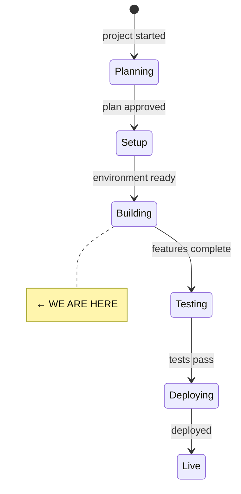
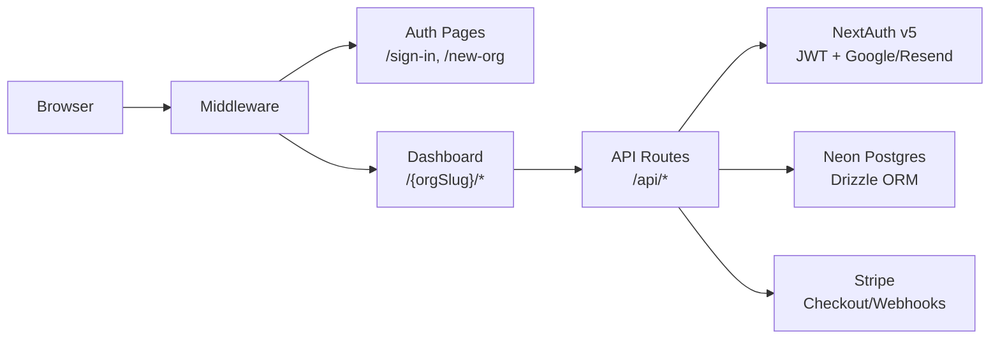

# State

> Last updated: 2026-02-22

## System State Diagram

## Component Status

| Component | Status | Notes |
|-----------|--------|-------|
| Project scaffolding | ✅ Done | Next.js 15, Tailwind v4, DM Sans, earth-tone theme |
| Database schema | ✅ Done | 7 schema files, centralized relations.ts, all enums |
| Auth (NextAuth v5) | ✅ Done | Google + Resend providers, JWT, lazy adapter Proxy |
| Middleware | ✅ Done | Protects org routes, allows /sign-in, /new-org, /api |
| API routes | ✅ Done | 12 route files — orgs, members, connections, moments, stripe |
| Dashboard pages | ✅ Done | 8 pages — dashboard, connections (list/new/detail), moments/new, settings, billing, members |
| Auth pages | ✅ Done | Sign-in (Google + magic link), new-org creation |
| UI components | ✅ Done | 12 primitives (button, input, card, badge, dialog, etc.) |
| Layout (sidebar/header/mobile) | ✅ Done | Responsive sidebar, mobile drawer, dynamic org-slug nav |
| Feature components | ✅ Done | Connection list/card/form/picker, moment form/card/list, org forms, billing |
| Stripe integration | ✅ Done | Lazy client, checkout, portal, webhook handler |
| Validators (Zod) | ✅ Done | Org, connection, moment, auth schemas (using zod/v3) |
| CI/CD | ✅ Done | GitHub Actions: lint, typecheck, test, build |
| Unit tests | ✅ Done | 12 tests (slugify + permissions) |
| Homepage flow | ✅ Done | CTA for unauth, auto-redirect for auth users |
| DB migration | ⏳ Not started | Need to run `db:push` against Neon once credentials work |
| Runtime testing | ⏳ Not started | Needs Google OAuth + Neon credentials configured |
| Git init + first commit | ⏳ Not started | All files untracked |

## Architecture

## Key Files

| Path | Purpose |
|------|---------|
| `src/lib/db/index.ts` | Lazy Proxy DB — only connects on first query |
| `src/lib/db/schema/` | 7 schema files + relations.ts + index.ts barrel |
| `src/lib/auth/index.ts` | NextAuth config with lazy adapter Proxy (4 traps) |
| `src/lib/auth/permissions.ts` | Role hierarchy, getMembership, requireMembership |
| `src/lib/utils/api.ts` | Response helpers, getAuthenticatedUser, getOrgContext |
| `src/lib/config/plans.ts` | Plan limits + Stripe price IDs |
| `src/lib/validators/` | Zod schemas for all entities |
| `src/middleware.ts` | Route protection |
| `src/components/layout/sidebar.tsx` | Dynamic nav with getNavItems(orgSlug) |

## Dependencies

| Dependency | Status | Notes |
|------------|--------|-------|
| Neon Postgres | Not verified | DATABASE_URL is in .env.example — needs .env.local |
| Google OAuth | Not set up | Need AUTH_GOOGLE_ID + AUTH_GOOGLE_SECRET |
| AUTH_SECRET | Set in .env.example | Run `npx auth secret` to set in .env.local |
| Resend (email) | Not set up | Need AUTH_RESEND_KEY |
| Stripe | Not set up | Need STRIPE_SECRET_KEY + price IDs |

## Build Status

- `npm run build` — passes (24 routes, 0 errors)
- `npm run lint` — passes
- `npx tsc --noEmit` — passes
- `npm test` — 12 tests pass (slugify: 6, permissions: 6)

<!--
Keep this file as the single source of truth for "where are we?"
The /status command reads this file.
-->
