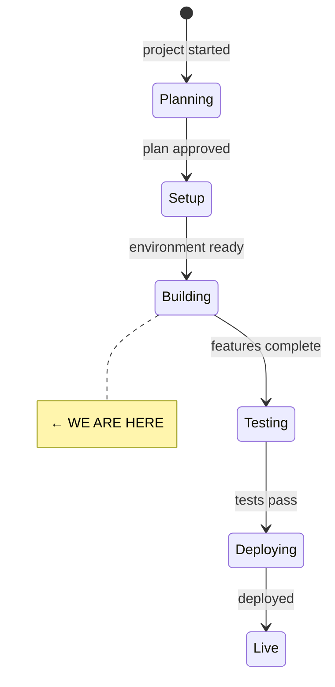
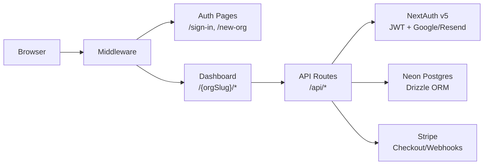

# State

> Last updated: 2026-07-02

## System State Diagram

## Component Status

| Component | Status | Notes |
|-----------|--------|-------|
| Project scaffolding | ✅ Done | Next.js 15, Tailwind v4, DM Sans, earth-tone theme |
| Database schema | ✅ Done | 7 schema files, centralized relations.ts, all enums |
| Auth (NextAuth v5) | ✅ Done | Google + Resend providers, JWT, lazy adapter Proxy |
| Middleware | ✅ Done | Protects org routes, allows /sign-in, /new-org, /api |
| API routes | ✅ Done | 12 route files — orgs, members, connections, moments, stripe |
| Dashboard pages | ✅ Done | 8 pages — dashboard, connections (list/new/detail), moments/new, settings, billing, members |
| Auth pages | ✅ Done | Sign-in (Google + magic link), new-org creation |
| UI components | ✅ Done | 12 primitives (button, input, card, badge, dialog, etc.) |
| Layout (sidebar/header/mobile) | ✅ Done | Responsive sidebar, mobile drawer, dynamic org-slug nav |
| Feature components | ✅ Done | Connection list/card/form/picker, moment form/card/list, org forms, billing |
| Stripe integration | ✅ Done | Lazy client, checkout, portal, webhook handler |
| Validators (Zod) | ✅ Done | Org, connection, moment, auth schemas (using zod/v3) |
| CI/CD | ✅ Done | GitHub Actions: lint, typecheck, test, build |
| Unit tests | ✅ Done | 12 tests (slugify + permissions) |
| Homepage flow | ✅ Done | CTA for unauth, auto-redirect for auth users |
| Network data model | ✅ Done | `network_links` table, canonical pair strength calc, co-mention inference hook, `GET /api/network` |
| Cluster detection | ✅ Done | Deterministic label propagation (`src/lib/network/clusters.ts`), wired into `GET /api/network` as `clusterId` per node |
| D3 network view | ✅ Done | `/{orgSlug}/network` page, static force-directed SVG render, nodes sized/colored, edges styled by strength |
| Network interactions | ✅ Done | Pan/zoom, node drag, hover tooltip, click-to-navigate to connection detail, type/strength/unconnected filters, search-and-center (`network-graph.tsx`, `network-controls.tsx`) |
| Connection story view | ✅ Done | Story section always visible (with empty state), moment stream now reuses `MomentList`/`MomentCard` |
| Quality spectrum UI | ✅ Done | 5 hardcoded spectrums (depth/reciprocity/formality/activity/maturity), manual position-setting via `POST /api/connections/[connectionId]/qualities`, sparkline history, wired into connection detail page |
| AI provider registry | ✅ Done | OpenRouter primary + local Ollama fallback via `withFallback()` (`src/lib/ai/`). Task→model config |
| AI moment understanding | ✅ Done | `POST /api/moments/understand` (read-only, no DB writes), structured output via `generateObject` (`run-object-task.ts`, `moment-understanding.ts`). Moment form now has an "Understand with AI" panel — matches existing connections (checkbox to add), lists unmatched entities (informational only, no auto-create), suggests quality signals (Apply button → existing qualities route), detects event date (prefills new date field). Moment form also gained its first-ever event date input |
| DB migration | ⏳ Not started | Migration SQL generated (`drizzle/0000_cloudy_morlocks.sql`); need to run `db:push` against Neon once credentials work |
| Runtime testing | ⏳ Not started | Needs Google OAuth + Neon credentials configured |
| Git init + first commit | ✅ Done | Initial commit `e21576a` |

## Architecture

## Key Files

| Path | Purpose |
|------|---------|
| `src/lib/db/index.ts` | Lazy Proxy DB — only connects on first query |
| `src/lib/db/schema/` | 7 schema files + relations.ts + index.ts barrel |
| `src/lib/auth/index.ts` | NextAuth config with lazy adapter Proxy (4 traps) |
| `src/lib/auth/permissions.ts` | Role hierarchy, getMembership, requireMembership |
| `src/lib/utils/api.ts` | Response helpers, getAuthenticatedUser, getOrgContext |
| `src/lib/config/plans.ts` | Plan limits + Stripe price IDs |
| `src/lib/validators/` | Zod schemas for all entities |
| `src/middleware.ts` | Route protection |
| `src/components/layout/sidebar.tsx` | Dynamic nav with getNavItems(orgSlug) |

## Dependencies

| Dependency | Status | Notes |
|------------|--------|-------|
| Neon Postgres | Configured | `DATABASE_URL` is set in `.env.local`; dev server boots and `/api/network` responds (401 unauthenticated, as expected) — full authenticated flow still needs Google OAuth |
| Google OAuth | Not set up | Need AUTH_GOOGLE_ID + AUTH_GOOGLE_SECRET |
| AUTH_SECRET | Set in .env.example | Run `npx auth secret` to set in .env.local |
| Resend (email) | Not set up | Need AUTH_RESEND_KEY |
| Stripe | Not set up | Need STRIPE_SECRET_KEY + price IDs |
| OpenRouter | Not set up | Need OPENROUTER_API_KEY — falls back to local Ollama automatically if unset |
| Ollama (local) | Optional | `OLLAMA_BASE_URL` defaults to `http://localhost:11434/v1`, `OLLAMA_MODEL` defaults to `llama3.2` — used as fallback when OpenRouter fails or is unconfigured |

## Build Status

- `npm run build` — passes (26 routes, 0 errors)
- `npx tsc --noEmit` — passes
- `npm test` — 28 tests pass (slugify: 6, permissions: 6, network strength: 7, clusters: 6, AI fallback: 3). No new tests for the moment-understanding feature — it's thin wiring around already-tested fallback logic, no new branching to exercise
- `npm run lint` — 1 pre-existing error unrelated to network work (`settings/members/page.tsx` setState-in-effect)
- Dev server smoke test: boots cleanly against the real Neon DB, `/api/network` correctly 401s unauthenticated, `/` returns 200

## Known Issues (additions)

- **jsdom test environment is broken in this dev environment**: Node is
  v20.18.1, but jsdom 27's `@csstools/css-calc` (via `@asamuzakjp/css-color`)
  requires Node ≥20.19 and ships an ESM-only build that fails a CJS
  `require()` at vitest worker startup (`ERR_REQUIRE_ESM`). This means no
  `@testing-library/react` component test can run here until Node is
  upgraded — not just the "cosmetic" engine warning previously noted.
  A planned smoke test for `network-graph.tsx` was dropped for this reason;
  see MISTAKES.md.

<!--
Keep this file as the single source of truth for "where are we?"
The /status command reads this file.
-->
